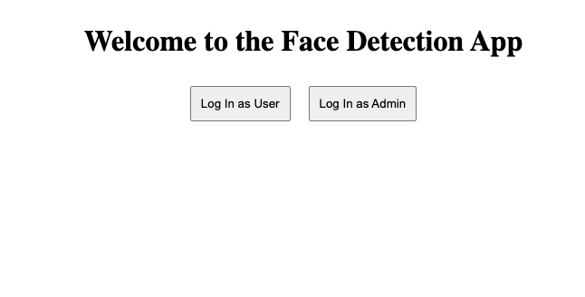

## Motorola Tech Test

This is my submission for the technical task for the role at Calypso, a subsidary of Motorola.

## Getting started

Ensure you have the latest versions of Node and Vue installed

1) cd into the backend directory and type "npm install" to install the dependancies
2) run "npm start" to run the server
3) cd into the frontend directory and type "npm install" to install the dependancies
4) un "npm run server" to run the client
5) Have fun!

OR

if you want to run the docker container

enter "docker-compose up --build" in the terminal

Before this, ensure you have docker and docker-compose installed

There are 4 endpoints in the backend

1) GET /admin-summary
2) GET /requests
3) POST /create-request
4) POST /user-login

Due to time constaints, I was not able to finish the admin user flow, I did manage to create the login page for the admin user

### Improvements

1) Create admin stats page on UI which retrieves all the requests made by all the users, this page would call the /admin-summary endpoint
2) Create a search filter feature on the admin UI so the admin can filter through the requests
3) Create /login-admin endpoint which handles the admin signing into the platform

